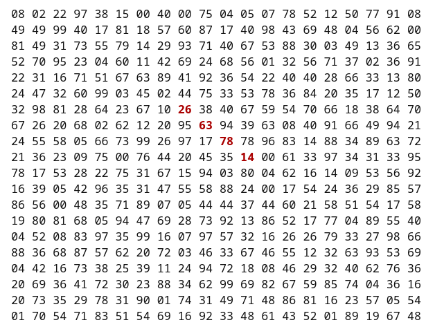

# Problem 11

### Largest Product in a Grid

In the 20 X 20 grid below, four numbers along a diagonal line have been marked in red.



The product of these number is 26 X 63 X 78 X 14 = 1788696

### Solution:
- 20 X 20 divide into 5(4 X 4) 
- Each 4 X 4 grid (calculate the number of possible combinations of four adjacent numbers)
- Total combinations per 4x4 grid is 10
- Total combinations for 20x20 grid is **NOT 5 x 10** (my dumbass thought so)

##### SOoOoOooO, heRe iS hOw:
To determine the number of combinations of four adjacent number in a 20x20 grid. These combinations can be aligned in any of the following directors:
- 1. Horizontal (left to right)
- 2. Vertical (top to bottom)
- 3. Diagonal (top-left to bottom-right)
- 4. Diagonal (top-right to bottom-left)

To accurately calculate the number of combinations in a 20x20 grid, break it down into each direction:

1. Horizontal combinations
- Per row: In a single row of 20 numbers, the number of ways to select 4 adjacent numbers is:
`Combinions per row = Total numbers - Sequence length + 1`
`20 - 4 + 1 = 17`
- **Total Horizontal Combinations:** `20 rows X 17 combinations per row = 340`

2. Vertical combinations
- Per column: In each column of 20 numbers:
`Combinations per colum = 17`
- **Total Vertical Combinations:** `20 columns x 17 combinations per column = 340`

3. Diagonal Combinations
There are two diagonal directions to consider:
- 1. Top-Left to Bottom-Right Diagonals
    -  Starting positions: For a 20 X 20 grid, the number of starting positions where a 4-number diagonal can fit is:
    - `(20 - 3) X (20 - 3) = 17 X 17 = 289`

- 2. Top-Right to Bottom-Left Diagonals
    - Starting positions: `17 X 17 = 289`

- Total Diagonal Combinations = `289(TL-BR) + 289(TR-BL) = 578`

**Total Combinations in All Directions** = `340 + 340 + 578 = 1258`

### Pseudocode
- Transeverse grid with nested loop for each cell
- Calculate in all directions 
- Compare previous\_max, if true replace with current\_max

```
find_max(grid):
    max_product=0

    for row from 0 to 19:
        for col from 0 to 19:
        
        if col<=16:
            product=grid[row][col]*grid[row][col+1]*grid[row][col+2]*grid[row][col+3]
            max_product=max(max_product,product) 

        if row <= 16:  
                product = grid[row][col] * grid[row+1][col] * grid[row+2][col] * grid[row+3][col]
                max_product = max(max_product, product)
        if row <= 16 and col <= 16:  
                product = grid[row][col] * grid[row+1][col+1] * grid[row+2][col+2] * grid[row+3][col+3]
                max_product = max(max_product, product)

        if row <= 16 and col >= 3:  // Ensure there are 4 adjacent numbers diagonally
                product = grid[row][col] * grid[row+1][col-1] * grid[row+2][col-2] * grid[row+3][col-3]
                max_product = max(max_product, product)

```

